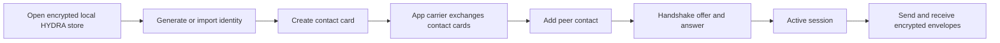
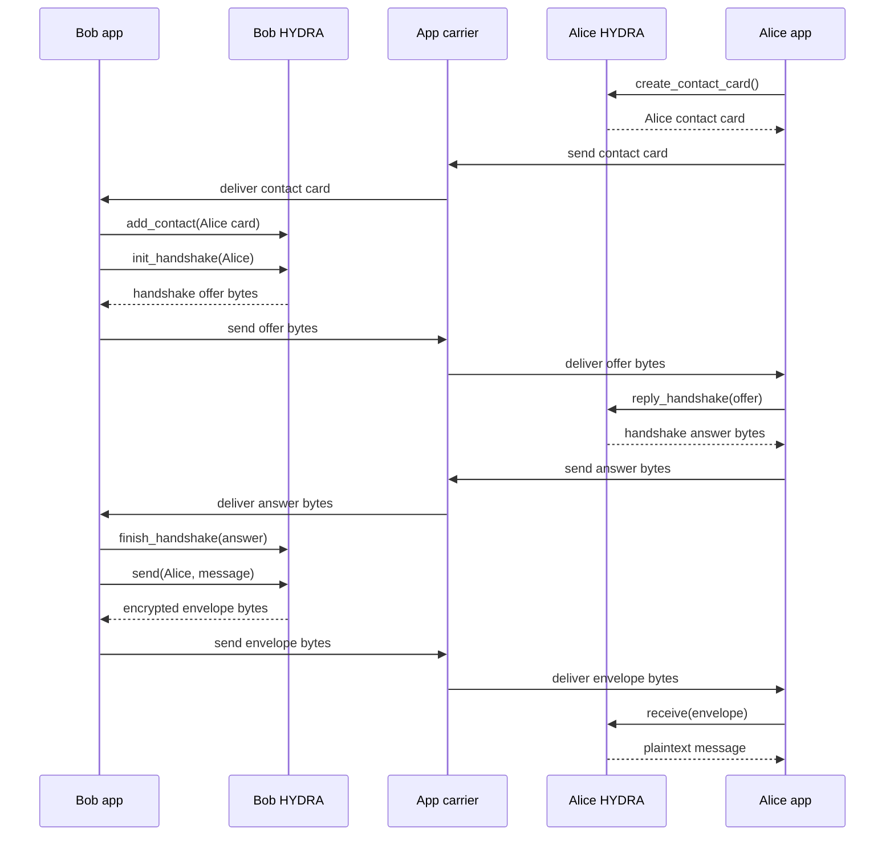

# How HYDRA messaging works

## Navigation

- [Main README](../../../README.md)
- [How HYDRA messaging works](README.md)
- [Spec docs and repo structure](../../spec/README.md)
- [Crates](../../../crates/README.md)
- [Examples](../../../examples/README.md)
- [Public developer API](../../spec/public-developer-api.md)
- [Benchmark notes](../../validation/benchmark-results.md)

## The short version

HYDRA is the encrypted messaging layer. Your app provides the carrier.

```text
HYDRA creates opaque bytes.
Your app moves those bytes.
HYDRA opens those bytes on the other side.
```

A normal HYDRA message needs a peer relationship and an active session. In app terms, that usually means:

```text
identity -> contact card exchange -> contact -> handshake -> session -> encrypted message
```

## Main flow



## Two-device message flow



## Do users need contacts first?

For normal encrypted send/receive, yes: HYDRA needs peer key material and an active session so the receiver can decrypt. The facade session is established by a signed hybrid handshake: ML-DSA authenticates the peer identity, ephemeral X25519 contributes classical forward secrecy, ephemeral ML-KEM-768 contributes post-quantum store-now-decrypt-later resistance, and the answer confirmation tag proves transcript/key agreement before session installation on the initiator side.

That does not mean your app has to expose a traditional contact list. The app can hide the contact model behind an invite, QR code, temporary chat link, support-ticket inbox, lobby join flow, relay pickup flow, or one-time identity.

Internally, the clean model is still:

```text
peer key material -> contact record -> session -> encrypted envelope
```

## Can an app support anonymous chats?

Yes, but the normal HYDRA message path is still key/session based. The receiver needs peer key material and an active session to decrypt. The app decides whether that key material is a long-lived identity, a one-time identity, a lobby-specific identity, or a credential-backed identity.

Use these distinctions when designing or documenting anonymity:

```text
Anonymous to the other user:
  Use a one-time HYDRA identity/contact card for that chat.

Unlinkable across chats:
  Use fresh identities per chat/lobby and do not reuse contact cards, invites, mailbox IDs, or app-account handles.

Anonymous to the server/relay:
  A relay only needs opaque HYDRA bytes, but it may still see timing, IP addresses, mailbox IDs, request sizes, and routing metadata unless the carrier hides that too.

Anonymous to the network:
  Requires a Tor/I2P/mixnet/proxy/relay design. HYDRA encryption by itself does not hide network endpoints or traffic patterns.

Anonymous-but-authorized:
  Requires a separate auth/privacy layer, such as proofs, blind credentials, tokens, or another unlinkable eligibility mechanism. Plain contact cards authenticate keys; they do not prove private eligibility.
```

HYDRA should still treat the peer as a key-bearing contact/session internally. That keeps decryption, replay handling, safety-code checks, and message ownership coherent.

## What does HYDRA still expose locally or as metadata?

Current facade boundaries:

```text
state-v2.hydra local file: authenticated-encrypted state when opened with a state password
legacy state-v1.hydra: migrates through open_with_state_password, then is removed after v2 write
identity and state passwords: AEAD wrapping, but not memory-hard KDF yet
contact cards: label, public key, contact id/fingerprint, and safety code are visible
lobby invites: lobby id, label, max-member policy, and member list are visible
lobby recipient(): per-member routing hint, not anonymous routing or authentication
carrier/network layer: timing, IP, request size, mailbox id, and routing metadata remain carrier concerns
```

These are intentional boundary statements, not final privacy goals. Apps that need unlinkability should use fresh identities, contact cards, invites, and carrier/mailbox identifiers for each chat or lobby until first-class one-time helpers exist.

## What is contact verification?

Contact verification is a trust flag for the app UI.

When a contact is added, HYDRA can show a safety code. The app can ask the user to compare that code with the other person through a separate channel such as in-person, phone, QR, video call, or an already-trusted account.

Basic send/receive can work before a contact is marked verified. Verification is how the app distinguishes:

```text
I have a key for this peer.
```

from:

```text
The user confirmed this key belongs to the expected peer.
```

## What does the carrier do?

The carrier only moves bytes.

Examples:

```text
WebRTC DataChannel
HTTP request
relay server
mailbox server
file on disk
QR code
clipboard
manual copy/paste
libp2p stream
Kaspa pointer to encrypted data
```

The carrier should not need to understand HYDRA identities, sessions, plaintext, attachments, lobbies, or message internals.

## What should app developers start with?

For a normal 1:1 app:

```text
1. Open HYDRA.
2. Generate or import the user's identity.
3. Let the user share a contact card.
4. Let the user add another contact card.
5. Carry handshake offer/answer bytes through the app.
6. Carry encrypted envelope bytes through the app.
7. Display received plaintext and attachments.
```

For runnable code, start with:

- [Handshake roundtrip example](../../../examples/handshake_roundtrip/README.md)
- [Manual file carrier example](../../../examples/manual_file_carrier/README.md)
- [WebRTC manual carrier example](../../../examples/webrtc_manual_carrier/README.md)
