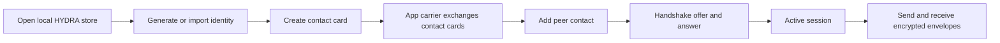
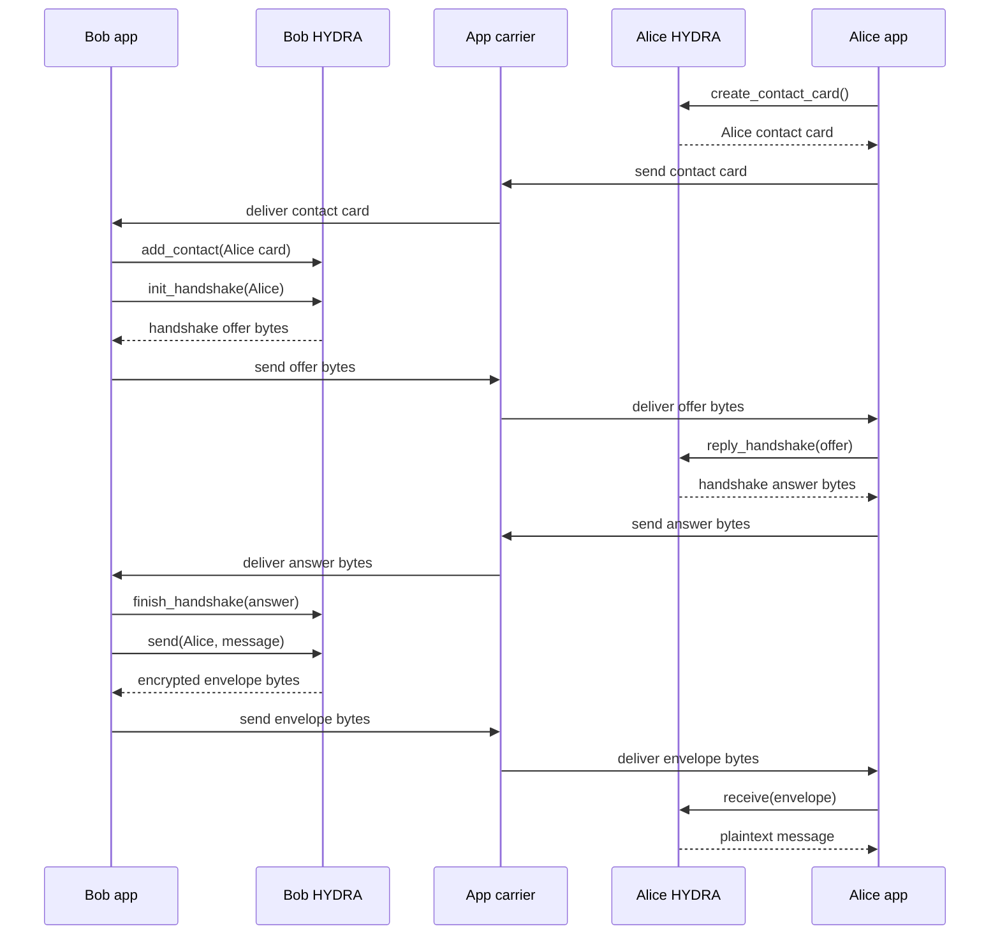

# How HYDRA messaging works

## Navigation

- [Main README](../../../README.md)
- [Crates](../../../crates/README.md)
- [Examples](../../../examples/README.md)
- [Public developer API](../public-developer-api.md)
- [Benchmark notes](../benchmark-results.md)

## The short version

HYDRA is the encrypted messaging layer. Your app provides the carrier.

```text
HYDRA creates opaque bytes.
Your app moves those bytes.
HYDRA opens those bytes on the other side.
```

A normal HYDRA message needs a peer relationship and an active session. In app terms, that usually means:

```text
identity -> contact card exchange -> contact -> handshake -> session -> encrypted message
```

## Main flow



## Two-device message flow



## Do users need contacts first?

For normal encrypted send/receive, yes: HYDRA needs peer key material and an active session so the receiver can decrypt.

That does not mean your app has to expose a traditional contact list. The app can hide the contact model behind an invite, QR code, temporary chat link, support-ticket inbox, lobby join flow, relay pickup flow, or one-time identity.

Internally, the clean model is still:

```text
peer key material -> contact record -> session -> encrypted envelope
```

## Can an app support anonymous-feeling chats?

Yes, at the app layer.

Useful patterns:

```text
One-time identity:
  Generate a fresh identity for a single chat or lobby.

Temporary contact:
  Add the peer contact for one session, then remove it when the chat ends.

Invite link or QR:
  Encode a contact card or invite payload and let the receiver import it.

Unknown inbox:
  Accept handshake offers from unknown peers, show them as untrusted requests,
  and only mark them trusted if the user confirms.
```

HYDRA should still treat the peer as a key-bearing contact/session internally. That keeps decryption, replay handling, safety-code checks, and message ownership coherent.

## What is contact verification?

Contact verification is a trust flag for the app UI.

When a contact is added, HYDRA can show a safety code. The app can ask the user to compare that code with the other person through a separate channel such as in-person, phone, QR, video call, or an already-trusted account.

Basic send/receive can work before a contact is marked verified. Verification is how the app distinguishes:

```text
I have a key for this peer.
```

from:

```text
The user confirmed this key belongs to the expected peer.
```

## What does the carrier do?

The carrier only moves bytes.

Examples:

```text
WebRTC DataChannel
HTTP request
relay server
mailbox server
file on disk
QR code
clipboard
manual copy/paste
libp2p stream
Kaspa pointer to encrypted data
```

The carrier should not need to understand HYDRA identities, sessions, plaintext, attachments, lobbies, or message internals.

## What should app developers start with?

For a normal 1:1 app:

```text
1. Open HYDRA.
2. Generate or import the user's identity.
3. Let the user share a contact card.
4. Let the user add another contact card.
5. Carry handshake offer/answer bytes through the app.
6. Carry encrypted envelope bytes through the app.
7. Display received plaintext and attachments.
```

For runnable code, start with:

- [Handshake roundtrip example](../../../examples/handshake_roundtrip/README.md)
- [Manual file carrier example](../../../examples/manual_file_carrier/README.md)
- [WebRTC manual carrier example](../../../examples/webrtc_manual_carrier/README.md)
